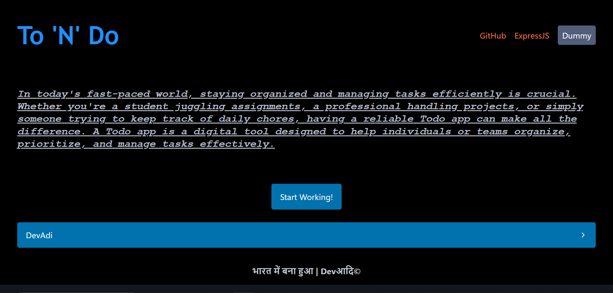
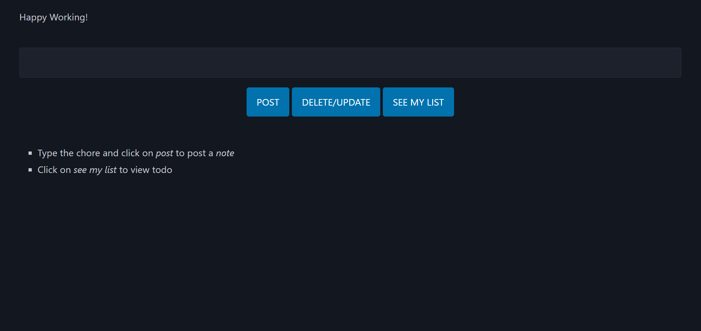
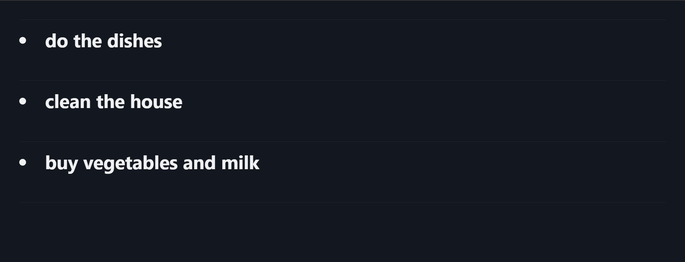
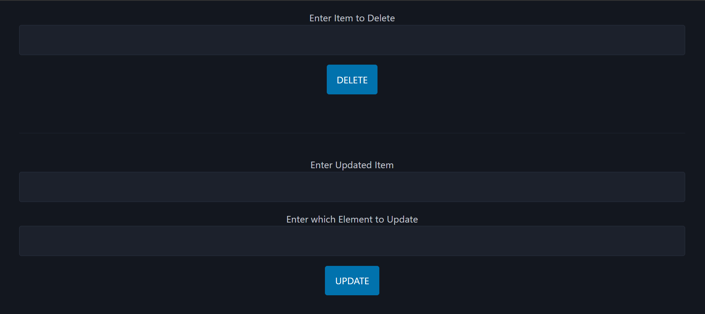

# To-N-Do
a todo app which has delete and update function

<ul>
  <li>used express js for backend scripting</li>
  <li>html and picoCSS were used to do the client scripting</li>
</ul>

# How To Run

install git and clone this repo

open terminal in your ide and type node main

make sure you have installed node js

# ProjSnaps

